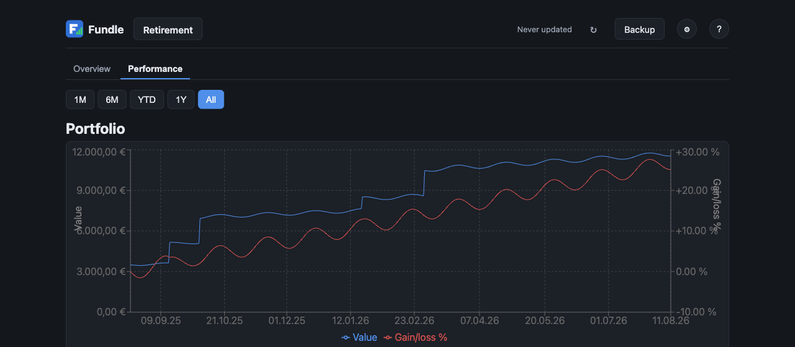

<p align="center">
  
</p>

<h1 align="center">Fundle</h1>

<p align="center">
  A free, private portfolio tracker for stocks and ETFs that runs entirely in your browser.
</p>



## What it does

Fundle keeps track of what you own and how it's doing — without a server, an account, or your
data ever leaving your device.

- Add any number of portfolios, each with the stocks or ETFs you hold and the buy orders behind
  them (date, quantity, price, optional fee).
- See the current price, today's change, and how each position and the whole portfolio is doing
  against what you paid.
- A performance chart shows the portfolio's value over time next to its actual percentage gain or
  loss — separating real investment performance from money you simply added.
- Export your data to a file and import it again later, including price history, so switching
  devices doesn't mean waiting for everything to reload.

Everything runs client-side: no account, no server, no tracking. Your portfolio data stays in
your browser, and you're always one export away from a backup.

The app has an in-app help screen (the **?** button in the header) that walks through the same
ground for anyone who wants more detail while using it.

## Running locally

```bash
npm install
npm run dev
```

Opens on `http://localhost:5173`. Other scripts:

```bash
npm test        # vitest
npm run build   # production build into dist/
npm run preview # serve the production build locally
```

## Deploying to GitHub Pages

`.github/workflows/deploy.yml` builds and publishes `dist/` on every push to `main`. Enable it
once per repository: **Settings → Pages → Build and deployment → Source: GitHub Actions**. Push
to `main` and the app is live at `https://<user>.github.io/<repo>/` a minute or two later. The
Vite `base` is `./`, so the same build works on a user site and on a project subpath.

To deploy anywhere else, `npm run build` and serve the `dist/` folder — it is plain static files,
no server-side code involved.

## Architecture

```
src/
  domain/       pure model and math, no IO         types, metrics, portfolio, performance
  data/         market-data port and adapters       PriceProvider, yahoo, twelvedata, proxy
  app/          state, scheduling, persistence      store, persistence, schema
  ui/           React views                         Overview, PerformanceView, AddAssetForm, SettingsView
```

Dependencies point inwards only: `ui` → `app` → `data`/`domain`, and `domain` imports nothing.
Swapping in another market-data API means writing one more `PriceProvider` adapter.

## License

GPLv3 — see [LICENSE](LICENSE).
