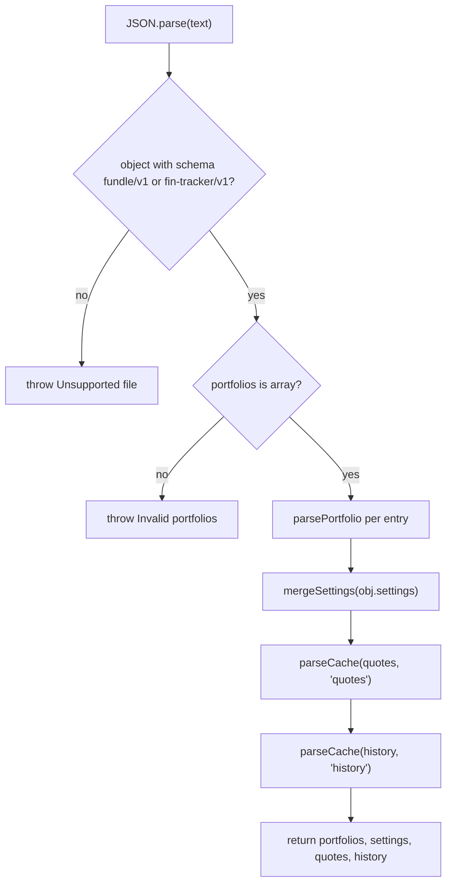

# Persistence (`src/app/persistence.ts`)

Persistence doubles as the export format: `localStorage` and the JSON export/import file use the same [`ExportFileV1`](schema.md) shape. `parseImport` is a **trust boundary** — it validates every field and never casts.

## Exports

- `serialize(portfolios, settings, now, cache?)` — builds an `ExportFileV1` (`{ schema, exportedAt, portfolios, settings, quotes, history }`) and `JSON.stringify`s it with 2-space indent. `cache` defaults to empty.
- `parseImport(text)` — returns `{ portfolios, settings, quotes, history }`, throwing on structural problems, dropping bad cache entries.
- `loadLocal()` / `saveLocal(...)` — thin localStorage wrappers around `serialize`/`parseImport`.

## Storage keys and legacy migration

- `STORAGE_KEY = 'fundle/v1'` (current).
- `LEGACY_STORAGE_KEY = 'fin-tracker/v1'` — the key used before the app was renamed from fin-tracker to Fundle. `loadLocal` reads the current key first, falls back to the legacy key. `parseImport` accepts `schema: 'fin-tracker/v1'` as well as `'fundle/v1'`, so legacy exports still import.

## `parseImport` — the trust boundary

### Field validators

- `requireString(value, path)` — throws `Invalid {path}: expected a non-empty string` on non-string/empty.
- `optionalString(value)` — returns the string or `undefined`.
- `requireNumber(value, path)` — coerces numeric strings via `Number(value)`, throws on non-finite.
- `idOrGenerate(value)` — keeps a non-empty string id, else `crypto.randomUUID()`. Imported ids are preserved; missing ids are generated.

### `parseLot`

Validates `date` (non-empty string), `quantity`/`price` (finite number, numeric-string coerced), `fee` (defaults to `0` when absent/null, else validated). **Drops unknown extra keys** — a `bogus: 'nope'` on a lot does not survive import.

### `parseSale`

Validates an `Asset.sale` object: `date` (non-empty string), `quantity`/`price` (finite number), `fee` (optional — left `undefined` when absent/null, unlike `parseLot` which defaults it to `0`). Returns `undefined` for an absent/null sale.

### `parseAsset` / `parsePortfolio`

Recursively validate `symbol`, `name`, `currency` (required strings), `isin`/`wkn` (optional), `lots`/`assets` (required arrays), and `sale` (optional, via `parseSale`).

### `mergeSettings(raw)` and the proxy-URL auto-migration

Spreads `raw` over `DEFAULT_SETTINGS`, then deep-merges `apiKeys` (so a partial `apiKeys` doesn't wipe other keys) and `clampRefreshMinutes`:

- `clampRefreshMinutes(value)` — `Number(value)` if finite, else `DEFAULT_SETTINGS.refreshMinutes`; clamped to `[1, 120]`. So an import with `refreshMinutes: 0` becomes `1`, and `9999` becomes `120`.
- `migrateProxyUrl(value)` — free CORS proxies keep dying (corsproxy.io now blocks every non-localhost origin; even working ones go down or get rate-limited). Each time the shipped default changes, anyone who already loaded the app is stuck on their persisted old value forever, since a saved setting always wins over a new code default. `OBSOLETE_PROXY_URLS` is a set of exact `proxyUrl` values this app has shipped as its *own* default in the past (`https://corsproxy.io/?url=`, `https://api.allorigins.win/raw?url=`, and the previous 3-entry public-only list `https://api.allorigins.win/raw?url=,https://api.cors.lol/?url=,https://api.codetabs.com/v1/proxy?quest=`); a persisted value matching one of them is auto-upgraded to the current `DEFAULT_SETTINGS.proxyUrl` (now the 4-entry list led by the self-hosted Worker). A value the user actually customized is left alone — only known past defaults are migrated, so this never overwrites a deliberate choice.

### Price cache: drop, don't throw

The price cache (quotes/history) is **disposable** — worst case on a bad entry is a refetch, not a broken portfolio. So unlike lots/assets, `parseQuote`/`parsePriceSeries` return `undefined` on any malformation, and `parseCache` skips those entries rather than throwing. A `quotes: { GOOD: {...}, BAD: { price: 'nope' } }` import keeps `GOOD` and drops `BAD`.

`parsePriceSeries` also filters malformed *points* out of a series (a point without a string `date` or finite `close` is dropped), so a partially-corrupt series still loads its good points.

## `loadLocal`

Reads `localStorage.getItem(STORAGE_KEY) ?? localStorage.getItem(LEGACY_STORAGE_KEY)`, calls `parseImport`, and returns `null` on any throw (quota/storage unavailable or corrupt JSON). The store's `buildInitialState` uses this to either hydrate from storage or create a default empty portfolio.

## `saveLocal`

`localStorage.setItem(STORAGE_KEY, serialize(...))`, wrapped in try/catch — quota exceeded or unavailable storage is silently ignored (persistence is best-effort).

## Focused tests (`src/app/persistence.test.ts`)

Covers the round-trip and the validation boundary:

- **Round-trip**: `serialize` → `parseImport` preserves portfolios and settings; `exportedAt` is an ISO string; the price cache round-trips (so a reload needs no refetch); a missing cache defaults to empty.
- **Validation**: rejects invalid JSON (`/Not valid JSON/`); rejects unknown schema (`/Unsupported file \(expected schema fundle\/v1\)/`); **accepts legacy `fin-tracker/v1`**; rejects `portfolios` not an array; rejects a lot with non-numeric `quantity`; **coerces numeric-string quantity** (`'10'` → `10`); **defaults missing fee to `0`**; **drops unknown lot keys**; merges partial settings over defaults; **auto-upgrades a `proxyUrl` matching a known-obsolete past default** (including the previous 3-entry public-only list) to the current list, but leaves a user-customized `proxyUrl` alone; imports a file with no `quotes`/`history` keys (older export) as empty cache; **drops a malformed cache entry** (keeps `GOOD`, drops `BAD`); **clamps `refreshMinutes` into `[1, 120]`** (0→1, 9999→120).

Run with `npm test`.
