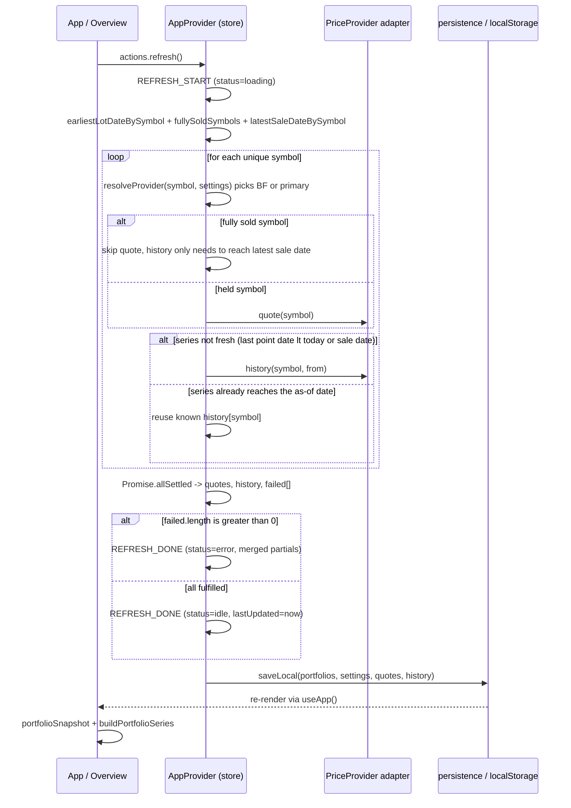

# Architecture Overview

Fundle is a **stateless, client-only portfolio tracker** for ETFs, stocks and similar assets. It runs entirely in the browser, keeps no server state, and deploys to GitHub Pages as static files. All persistence is `localStorage`; all market data comes from free public APIs — Yahoo Finance via a CORS proxy, Twelve Data with an API key, and Börse Frankfurt as an automatic supplementary ISIN-native quote source.

## Layers and dependency rule

```
src/
  domain/   pure model and math, no IO      types, metrics, portfolio, performance
  data/     market-data port and adapters   PriceProvider, yahoo, twelvedata, boerseFrankfurt, proxy
  app/      state, scheduling, persistence   store, persistence, schema
  ui/       React views                     Overview, PerformanceView, AddAssetForm, SettingsView, PortfolioMenu
```

Dependencies point **inwards only**: `ui` → `app` → `data`/`domain`, and `domain` imports nothing. The domain layer has no knowledge of React, fetch, or localStorage; it is pure functions over plain data types. This makes the portfolio math independently testable and lets the UI layer be swapped without touching the model.

The single seam that breaks the inwards rule is intentional: the `app` store imports `createProvider` from `data` to wire runtime settings to an adapter, and the `ui` forms call `actions.search()` which the store forwards to a provider. Everything still flows through the store, so the data layer never reaches back into `ui`.

## Module ownership

| Layer | Module | Owns |
| --- | --- | --- |
| domain | [types](../domain/model.md) | `Lot`, `Asset`, `Portfolio`, `PricePoint`, `PriceSeries`, `Quote` |
| domain | [metrics](../domain/model.md) | `AssetSnapshot`, `PortfolioSnapshot`, `SeriesPoint` result shapes |
| domain | [portfolio](../domain/portfolio.md) | quantity, cost basis, snapshots |
| domain | [performance](../domain/performance.md) | time-weighted return series |
| data | [PriceProvider](../data/price-provider.md) | port + `PriceProviderError` + factory/registry/`resolveProvider` dispatch |
| data | [yahoo](../data/yahoo.md) | Yahoo Finance adapter |
| data | [twelvedata](../data/twelvedata.md) | Twelve Data adapter |
| data | [Börse Frankfurt](../data/boerse-frankfurt.md) | supplementary ISIN-native quote adapter |
| app | [store](../app/store.md) | reducer, context, actions, refresh scheduling |
| app | [persistence](../app/persistence.md) | serialize/parseImport trust boundary, localStorage |
| app | [schema](../app/schema.md) | `Settings`, `ExportFileV1`, `DEFAULT_SETTINGS` |
| ui | [app-shell](../ui/app-shell.md) | `App.tsx`, `main.tsx`, header, tabs, format helpers |
| ui | [overview](../ui/overview.md) | asset table + lot detail |
| ui | [performance-view](../ui/performance-view.md) | value/TWR + per-asset charts |
| ui | [forms](../ui/forms.md) | add-asset, settings, backup, portfolio dialogs |

## Refresh data flow

The central runtime workflow is the price refresh, owned by the [store](../app/store.md). On mount, on an interval (`settings.refreshMinutes`), after adding an asset/lot, and after changing provider/proxy/apiKey settings, `refresh()` fetches a quote and — only when needed — a daily price series for every symbol across all portfolios, then merges the results into `state.quotes` / `state.history`. Symbols are dispatched per-symbol via [`resolveProvider`](../data/price-provider.md#factory-and-registry-srcdataindexts): `ISIN@MIC` composites route to [Börse Frankfurt](../data/boerse-frankfurt.md), everything else to the primary provider. Fully-sold symbols (every asset using the symbol has `sale` set) skip the live quote and only fetch history up to the latest sale date.



### Series freshness optimization

The daily series only gains a point once a day, so the interval tick refetches the quote but reuses a series that already reaches the as-of date. This halves the requests a rate-limited public CORS proxy sees. For a held symbol the as-of date is today; for a fully-sold symbol it is the latest sale date, since a sold-out symbol never needs a live price again. A series is considered fresh when its last point's date `>= asOf`.

## Key invariants

- **Buy-and-sell scope.** Positions are buy-only with an optional single full-position sale (`Asset.sale`). Partial sells, dividends, and FX conversion are not modelled. Buying more into a closed position clears `sale` and reopens it.
- **No FX conversion.** Amounts are used as returned by the provider, with no currency conversion, so mixing currencies inside one portfolio mixes units. `baseCurrency` only labels chart axes; it does not convert.
- **Cash-flow-neutral return.** The [performance](../domain/performance.md) `twrPct` line never moves on a purchase or a sale — only on price moves. See [Performance math](../domain/performance.md) for the algorithm and the forward-fill / cash-flow / sale rules.
- **Persistence doubles as the export format.** `localStorage` and the JSON export/import file use the same `ExportFileV1` shape, so restoring on another device needs no refetch (prices are cached in the file). Persisted `proxyUrl` values matching known-obsolete past defaults are auto-upgraded on load.
- **Import is a trust boundary.** [persistence](../app/persistence.md) `parseImport` validates every field and never casts; bad price-cache entries are dropped rather than thrown.

## Scope boundaries

Partial sells, dividends, and FX conversion are out of scope (see README "Architecture"). There is no FX conversion. The in-app help screen (the **?** button in the header, rendered by `HelpDialog`) covers the same ground for end users.

## Build and deploy

Vite builds static files into `dist/` with a relative `base: './'` so the same build works on a user site and a project subpath. The [deploy workflow](../operations/build-test-deploy.md) builds, tests, and publishes to GitHub Pages on every push to `main` (skipping doc/CI-only changes via `paths-ignore`).
