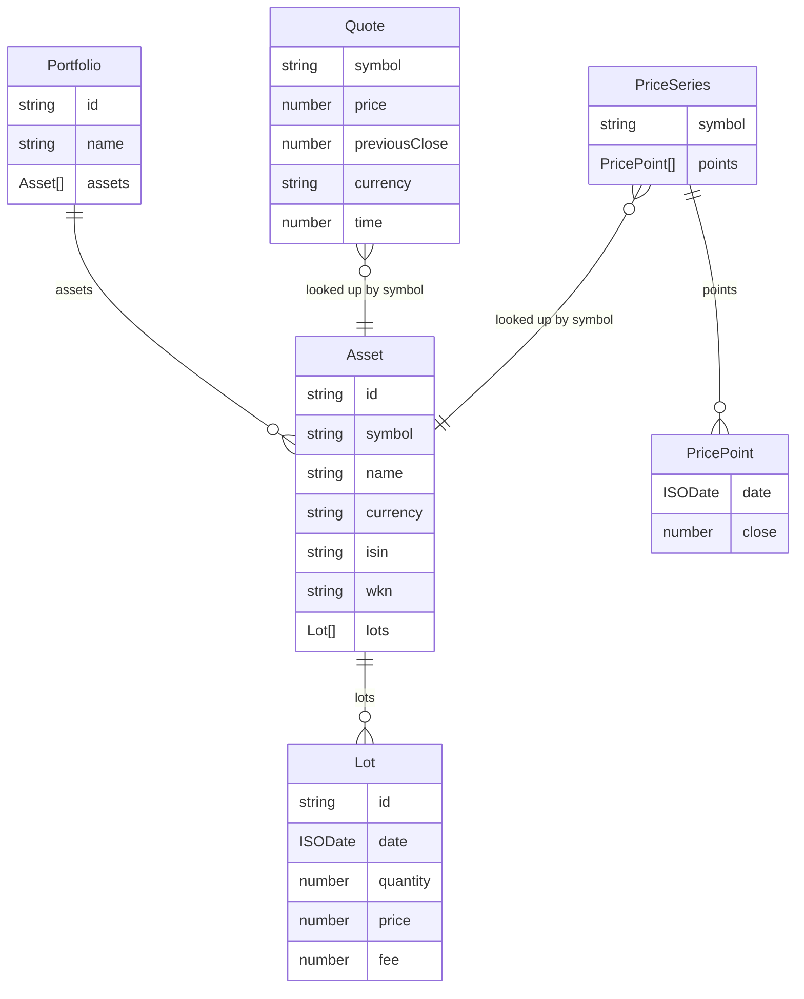

# Domain Model and Types

The domain layer (`src/domain/`) is pure data and math with no IO and no framework types. It owns two families of types: **entity types** in `types.ts` that describe the portfolio the user builds, and **result shapes** in `metrics.ts` that the snapshot and performance functions produce for the UI.

## Entity types (`src/domain/types.ts`)

### `ISODate`

`ISODate` is a `string` in `'YYYY-MM-DD'` form. Dates are compared as strings, which works because the format is lexicographically ordered. Lot dates are user-entered and may land on non-trading days (weekends/holidays); the [performance](performance.md) builder accounts for this by treating any lot dated between two charted dates as a cash flow into the later one.

### `Lot`

A single buy order ("lot"). Sells are out of scope. Fields: `id`, `date`, `quantity`, `price` (per share in the asset's currency), optional `fee` (in the asset's currency, counts towards cost basis).

### `Asset`

A holding. `symbol` is the provider symbol used for price lookups (e.g. `EUNL.DE`). `currency` is the asset's own currency — there is no FX conversion, so mixing currencies inside one portfolio mixes units. `isin`/`wkn` are optional identifiers used only for display.

### `Portfolio`

A named collection of assets. The app supports multiple portfolios; the store tracks `activePortfolioId` and a Performance view can aggregate "All portfolios".

### `PriceSeries` / `PricePoint`

Daily closes, ascending by date, with gaps (weekends/holidays) simply absent — the performance builder forward-fills missing days. `PricePoint` is `{ date, close }`.

### `Quote`

A current price snapshot: `price`, `previousClose` (previous trading day's close, for day-change figures), `currency`, and `time` (epoch milliseconds).

## Result shapes (`src/domain/metrics.ts`)

These are produced by [portfolio.ts](portfolio.md) (snapshots) and [performance.ts](performance.md) (series) and consumed by the UI. They are kept separate from entity types so the model never carries derived/display state.

### `AssetSnapshot`

Per-asset current view: `quantity`, `price`, `previousClose`, `marketValue`, `costBasis` (sum over lots of `quantity * price + fee`), `dayChangeAbs`/`dayChangePct`, `totalChangeAbs`/`totalChangePct`, plus the originating `asset`.

### `PortfolioSnapshot`

Aggregated view: `totalValue`, `totalCost`, `dayChangeAbs`/`dayChangePct`, `totalChangeAbs`/`totalChangePct`, and `assets` (the per-asset snapshots, sorted by `marketValue` descending).

### `SeriesPoint`

One point of a performance chart line (`src/domain/metrics.ts`):

- `value` — market value of everything held on that date.
- `cost` — cost basis of everything held on that date.
- `twrPct` — cumulative **time-weighted return** in percent, cash-flow neutral. Buying more does not move this line; only price moves do. Inflows are valued at the same close the position is valued at, so a buy price that differs from the provider's close (adjusted history, another exchange, fees) lands in `cost`, not here.
- `simplePct` — `value / cost - 1` in percent. Moves when new money comes in; shown as a dashed "incl. new money" line for contrast.

See [Performance math](performance.md) for how these are computed and why the two lines diverge.
