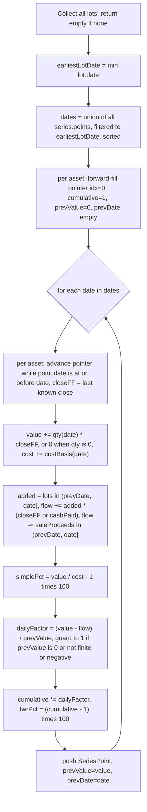

# Performance Math (`src/domain/performance.ts`)

`performance.ts` builds the chart series behind the [PerformanceView](../ui/performance-view.md). Its central job is a **time-weighted return (TWR)** that is *cash-flow neutral*: buying more shares must not move the return line, only price moves may. This is the invariant the whole module exists to preserve, and the one the tests guard most carefully. Sales are modelled as a negative cash flow (the proceeds) on the sale date, after which the asset's value contribution is `0`.

## Exports

- `buildPortfolioSeries(assets, seriesBySymbol): SeriesPoint[]` — the general case; one or more assets valued against their price series.
- `buildAssetSeries(asset, series): SeriesPoint[]` — convenience wrapper calling `buildPortfolioSeries([asset], { [asset.symbol]: series })`.

Each `SeriesPoint` carries `{ date, value, cost, twrPct, simplePct }` (see [result shapes](model.md)).

## The algorithm

### Why cash flow is valued at the market close, not the paid price

This is the subtle correctness point. An inflow is valued at the **same daily close the position is valued at**, not at the price the user paid. Those two differ routinely:

- providers serve **dividend-adjusted** closes,
- the fill may have happened on **another exchange**,
- there are **fees**.

Subtracting cash paid while adding market value would book that gap as a price move — which is the very jump this line must not have. The paid-vs-market difference is a **cost-basis effect**, so it stays visible in `value`, `cost` and `simplePct`, but never in `twrPct`.

The implementation captures this with `quantityAddedUntil` (shares added between `prevDate` and `date`) and `cashPaidUntil` (cash paid for those same lots, used only when no market price exists yet — i.e. before the asset has any price point). When a close is available, `flow` uses `added * closeFF`; when it is not, it falls back to `cashPaidUntil`.

### Full sales — `saleProceedsUntil`

`saleProceedsUntil(asset, after, date)` returns `sale.quantity * sale.price - (sale.fee ?? 0)` when the asset's `sale.date` falls in `(after, date]`, else `0`. It is the negative counterpart to `quantityAddedUntil`/`cashPaidUntil`: on the sale date the asset's quantity (and thus its `value` contribution) has already dropped to `0`, so subtracting the proceeds from `flow` makes that day's TWR factor `(0 - (-proceeds)) / prevValue` — i.e. it books the sale price against the last known mark-to-market value exactly once. Same weekend/holiday date-range handling as a buy: a Saturday-dated sale flows into the next charted (Monday) point.

The critical guard is the `quantity === 0 ? 0 : ...` branch in the value loop. A sold asset whose price series never arrived (fetch failure, cache miss) must value at `0`, **not** fall back to `costBasis` — that fallback is only a stand-in for "just bought, price not in yet" and must not resurrect a sold asset's value.

### Forward fill

Each asset keeps a pointer into its (ascending) price points. On each chart date, the pointer advances while `points[idx].date <= date`; the value used is `points[idx-1].close` (the last known close at or before the chart date). This means an asset whose series has no point on a given charted date (e.g. one exchange traded, another didn't) is still valued, and the union of all assets' dates forms the chart's x-axis. The forward-fill value is finite (never `NaN`).

### Non-trading-day lot/sale dating

Buy orders and sales are often dated on a day the exchange never traded (a weekend/holiday). Matching the date against the price axis exactly would silently drop the cash flow and report it as a gain/loss. Instead, `quantityAddedUntil`/`saleProceedsUntil` use `date > after && date <= date`, so a Saturday-dated lot or sale flows into the next charted (Monday) point.

### Daily factor and chaining

`dailyFactor = (value - flow) / prevValue` — the portfolio's end-of-day value minus that day's inflow (or plus the sale proceeds, which are a negative flow), divided by the previous day's value. `cumulative *= dailyFactor` chains it into a cumulative return; `twrPct = (cumulative - 1) * 100`.

Guards: if `prevValue <= 0`, the factor is not finite, or it is `<= 0`, it defaults to `1` (no change). This keeps the series finite even on the first point or after a total loss.

## The central invariant

> **Buying more must not move `twrPct` on the purchase day.**

Concretely, on a day where the only event is a purchase and the market close is unchanged from the previous day, `twrPct` must stay flat while `value`, `cost`, and `simplePct` inflate. The sale analog: a sale priced at the last mark leaves `twrPct` flat that day, then the line goes flat (value stays `0`) thereafter.

## Focused tests (`src/domain/performance.test.ts`)

The tests are named by the invariant they prove:

1. **`single lot, pure price movement -> twrPct tracks price 1:1`** — 100→110→121 yields `twrPct` `[0, 10, 21]`, exactly matching the price moves.
2. **`the invariant: buying more must not move twrPct on purchase day`** — two lots (10@100 on d1, 10@120 on d2), prices 100→120→132. On d2: `value=2400`, `cost=2200`, `simplePct≈9.09`, but `twrPct=20` (the pre-purchase return). On d3: `twrPct=32` (20% then +10%). Includes a regression guard that `simplePct` and `twrPct` *diverge* on a purchase day.
3. **`forward-fills a missing date ... without producing NaN`** — asset A missing d2, forward-filled at 100; B at 55; all of `value`, `twrPct`, `simplePct` finite.
4. **`an asset bought mid-series does not retroactively change earlier points`** — adding asset B dated d3 leaves d1/d2 points identical, only d3 gains B's value.
5. **`every twrPct/simplePct ... is finite`** — a multi-asset, multi-lot series has no `NaN`/`Infinity`.
6. **`a buy price above the market close does not become a price move`** — paid 200/share for a 100-close asset with a 10 fee; price flat on d2 so `twrPct=0`, but `cost=3010` and `simplePct` reflects the overpayment; d3 is a genuine +10%.
7. **`a buy dated on a non-trading day still counts as a cash flow, not a gain`** — Fri/Mon trade, Sat-dated lot; Monday's `twrPct` stays `0` despite `value` doubling.

### Sale tests (`describe('a full sale')`)

8. **`realizes the sale price against the last known value, then goes flat`** — bought 10@100, price rises to 150, sold all 10 @160 on d5. `value=0` on d5, the daily factor books `1600/1400` against the prior mark, and d6's `twrPct` equals d5's (flat thereafter).
9. **`a sale dated on a non-trading day is realized on the next charted date`** — Fri/Mon trade, Sat-dated sale at cost; Monday's `twrPct` stays `0`.
10. **`combined portfolio: sold asset drops out of value but keeps counting in cost and twr`** — held + sold asset; on the sale date `value` is held-only, `cost` includes both original costs, and the realized gain moves `twrPct` positive.
11. **`stays at 0 value even with no price data at all for the sold symbol`** — a sold asset with no price series must not fall back to its `costBasis` as value; `value` stays held-only while `cost` still counts the sold asset's original cost.

Run with `npm test`; the suite is `src/domain/performance.test.ts`.
