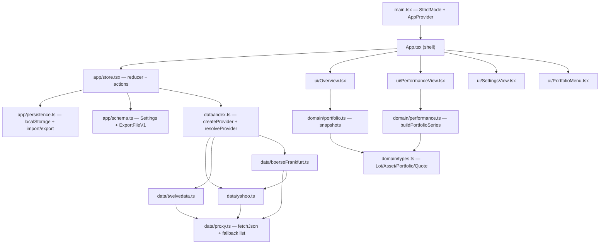

# Fundle Wiki — Quickstart

**Fundle** is a stateless, client-only portfolio tracker for ETFs, stocks and similar assets. It runs entirely in the browser, keeps no server state, persists to `localStorage`, and deploys to GitHub Pages as static files. The core intellectual content is a **time-weighted return** (TWR) calculation that stays flat on purchase days — buying more moves the value line, never the percentage line.

## High-level map


*The dependency rule: `ui` → `app` → `data`/`domain`, and `domain` imports nothing. Swapping in another market-data API means writing one more `PriceProvider` adapter.*

## Major sections

| Section | Page | What it covers |
| --- | --- | --- |
| **Architecture** | [Architecture overview](architecture/overview.md) | Layered architecture, dependency rule, data flow diagram, scope boundaries (buy + full sale, no FX) |
| **Domain** | [Domain model](domain/model.md) | `Lot`, `Asset`, `Portfolio`, `Quote`, `PriceSeries` types and `AssetSnapshot`/`PortfolioSnapshot`/`SeriesPoint` result shapes |
| | [Portfolio snapshots](domain/portfolio.md) | `assetQuantity`, `assetCostBasis`, `assetSnapshot`, `portfolioSnapshot`, `soldAssetSnapshot` — the point-in-time math behind the Overview table and header stats |
| | [Performance & TWR](domain/performance.md) | `buildPortfolioSeries` / `buildAssetSeries` — the time-weighted return algorithm, forward-fill, cash-flow neutrality, sale handling, and every tested invariant |
| **Data** | [PriceProvider port](data/price-provider.md) | The `PriceProvider` interface, `PriceProviderError`, `createProvider` factory, `resolveProvider` dispatch, `PROVIDERS` registry, and the multi-proxy `fetchJson` helper |
| | [Yahoo adapter](data/yahoo.md) | Yahoo Finance endpoints, CORS-proxy dependency, `adjclose` preference, `previousClose` vs `chartPreviousClose` |
| | [Twelve Data adapter](data/twelvedata.md) | Twelve Data endpoints, native CORS, `requireApiKey`, error-response detection |
| | [Börse Frankfurt adapter](data/boerse-frankfurt.md) | Supplementary ISIN-native quote source, `ISIN@MIC` symbols, history delegation to Yahoo |
| **App** | [Store](app/store.md) | `AppState`, the reducer, `AppActions` (incl. `sellAsset`), the refresh flow (concurrency guard, sold-out logic, `resolveProvider` dispatch, history reuse, `allSettled` partial-failure), persistence/interval effects |
| | [Persistence](app/persistence.md) | `serialize`/`parseImport` trust boundary, `loadLocal`/`saveLocal`, legacy `fin-tracker/v1` migration, stale-proxy auto-upgrade, strict-vs-lenient validation |
| | [Schema](app/schema.md) | `Settings`, `ExportFileV1`, `DEFAULT_SETTINGS` (3-proxy fallback list), schema IDs |
| **UI** | [App shell](ui/app-shell.md) | `main.tsx` bootstrap, `App.tsx` header/tabs, `format.ts` Intl helpers, `HelpDialog`, `Logo` |
| | [Overview tab](ui/overview.md) | Asset table, sold-assets table, expandable `AssetDetail` (lot editor, sell form, add-asset dialog) |
| | [Performance tab](ui/performance-view.md) | Dual-axis value/TWR chart, per-asset/per-portfolio lines, `viewAll` aggregation, range selection, line toggles, `simplePct` comparison |
| | [Forms & dialogs](ui/forms.md) | `AddAssetForm`, `SettingsView`, `BackupMenu`, `PortfolioDialogs`, `PortfolioMenu` |
| **Operations** | [Build, test & deploy](operations/build-test-deploy.md) | Vite/tsc scripts, strict `tsconfig`, vitest suite, GitHub Pages deploy, OpenWiki update + wiki-sync workflows |

## Core concepts

- **Time-weighted return (TWR)**: daily returns are chained after subtracting that day's cash flow, so a purchase or a full sale leaves the percentage untouched. Inflows are valued at the same daily close the position is valued at, not at the price paid — the paid-vs-market gap stays in `cost`/`simplePct`. See [Performance & TWR](domain/performance.md).
- **Full-position sale**: an `Asset.sale` records a single completed sale of the whole position; the asset drops out of the held table, its realized P/L shows in a sold-assets table, and the TWR line books the sale price against the last mark-to-market value exactly once. See [Portfolio snapshots](domain/portfolio.md).
- **PriceProvider port**: a `search`/`quote`/`history` interface with two user-selectable adapters (Yahoo via CORS proxy, Twelve Data via API key) and Börse Frankfurt as an automatic supplementary ISIN-native quote source. See [PriceProvider port](data/price-provider.md).
- **Multi-proxy fallback**: `proxyUrl` is a comma-separated list of CORS-proxy prefixes tried in order until one works, since free public proxies routinely go down or get rate-limited. See [PriceProvider port](data/price-provider.md).
- **Import trust boundary**: `parseImport` validates and reconstructs every portfolio/lot/sale field (throwing on bad data) but drops malformed price-cache entries (the cache is disposable). See [Persistence](app/persistence.md).
- **Stateless client-only model**: no server, no account; all state in `localStorage` under `fundle/v1`, with the export format doubling as the on-disk schema. See [Store](app/store.md) and [Schema](app/schema.md).

## Task routing

| Change intent | Page | Source entrypoints/symbols | Focused tests | Validation |
| --- | --- | --- | --- | --- |
| Change TWR math or add a performance invariant | [Performance & TWR](domain/performance.md) | `src/domain/performance.ts` `buildPortfolioSeries` / `saleProceedsUntil` | `src/domain/performance.test.ts` | `npm test` |
| Change snapshot math (cost basis, day change, sold assets) | [Portfolio snapshots](domain/portfolio.md) | `src/domain/portfolio.ts` `portfolioSnapshot` / `soldAssetSnapshot` | `src/domain/portfolio.test.ts` | `npm test` |
| Add or change a sale / sell flow | [Portfolio snapshots](domain/portfolio.md) / [Store](app/store.md) / [Overview](ui/overview.md) | `src/domain/types.ts` `Asset.sale`, `src/app/store.tsx` `sellAsset`, `src/ui/Overview.tsx` `AssetDetail` | `src/domain/portfolio.test.ts`, `src/domain/performance.test.ts` | `npm test` `npm run build` |
| Add a new market-data provider | [PriceProvider port](data/price-provider.md) | `src/data/PriceProvider.ts`, `src/data/index.ts` `PROVIDERS`/`createProvider`, `src/ui/SettingsView.tsx` | `src/data/yahoo.test.ts` (pattern) | `npm test` `npm run typecheck` |
| Change proxy fallback / timeout | [PriceProvider port](data/price-provider.md) | `src/data/proxy.ts` `fetchJson`/`proxyCandidates` | `src/data/proxy.test.ts` | `npm test` |
| Change Börse Frankfurt lookup / dispatch | [Börse Frankfurt](data/boerse-frankfurt.md) | `src/data/boerseFrankfurt.ts`, `src/data/index.ts` `resolveProvider`, `src/app/store.tsx` `search` | `src/data/boerseFrankfurt.test.ts` | `npm test` |
| Change Yahoo/Twelve Data parsing | [Yahoo](data/yahoo.md) / [Twelve Data](data/twelvedata.md) | `src/data/yahoo.ts` / `src/data/twelvedata.ts` | `src/data/yahoo.test.ts` | `npm test` |
| Change the store reducer or refresh flow | [Store](app/store.md) | `src/app/store.tsx` `reducer` / `refresh` | (indirect via persistence tests) | `npm test` `npm run typecheck` |
| Change import/export, localStorage schema, or proxy auto-migration | [Persistence](app/persistence.md) / [Schema](app/schema.md) | `src/app/persistence.ts` `parseImport`/`migrateProxyUrl`, `src/app/schema.ts` | `src/app/persistence.test.ts` | `npm test` |
| Change a UI view | [Overview](ui/overview.md) / [Performance](ui/performance-view.md) / [Forms](ui/forms.md) | `src/ui/*.tsx` | (none; thin glue) | `npm run build` |
| Change build, deploy, or CI | [Build, test & deploy](operations/build-test-deploy.md) | `vite.config.ts`, `tsconfig.json`, `.github/workflows/` | — | `npm run build` |

## Running locally

```bash
npm install
npm run dev      # http://localhost:5173
npm test         # vitest run
npm run build    # tsc -b && vite build -> dist/
npm run preview  # serve the production build
```

## Backlog

No deferred areas. The repository is fully covered: all four layers (domain, data, app, ui), all three market-data adapters (Yahoo, Twelve Data, Börse Frankfurt), the store/persistence/schema, every UI view, the PortfolioMenu, and all GitHub workflows (deploy, openwiki-update, wiki-sync). The only intentionally untested areas are the UI components (thin glue over tested store/domain code) and the Twelve Data adapter (exercises the same tested `proxy.ts` `fetchJson` path as Yahoo).
